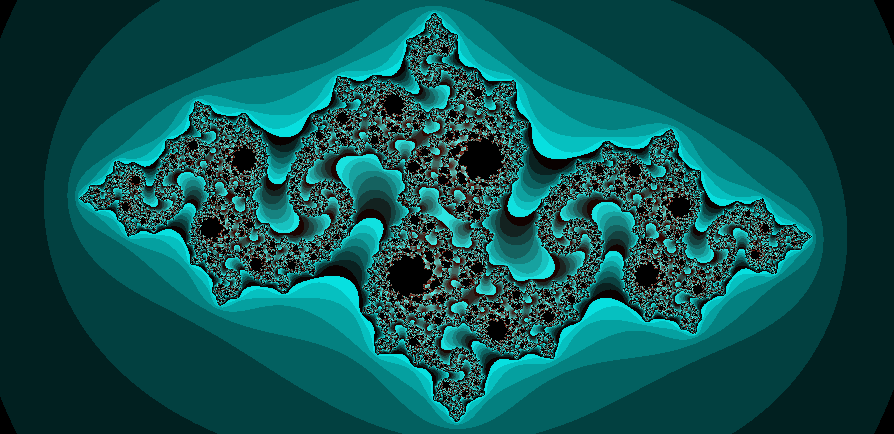
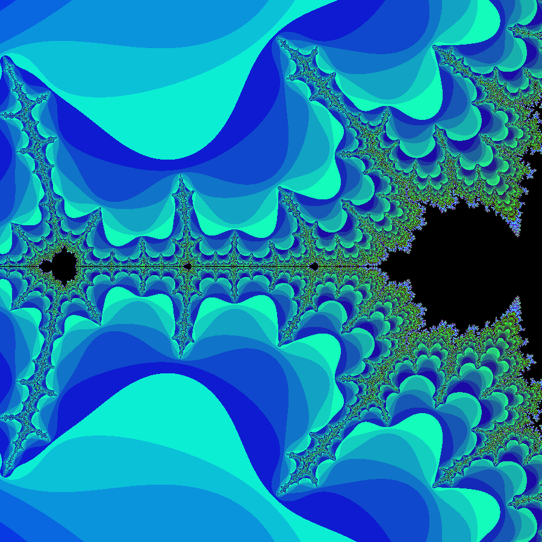
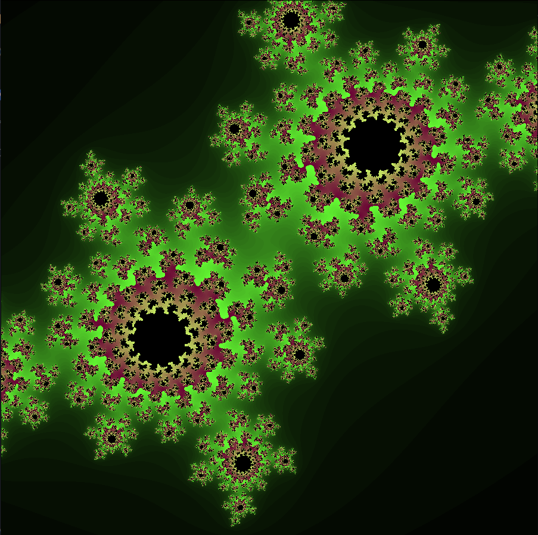
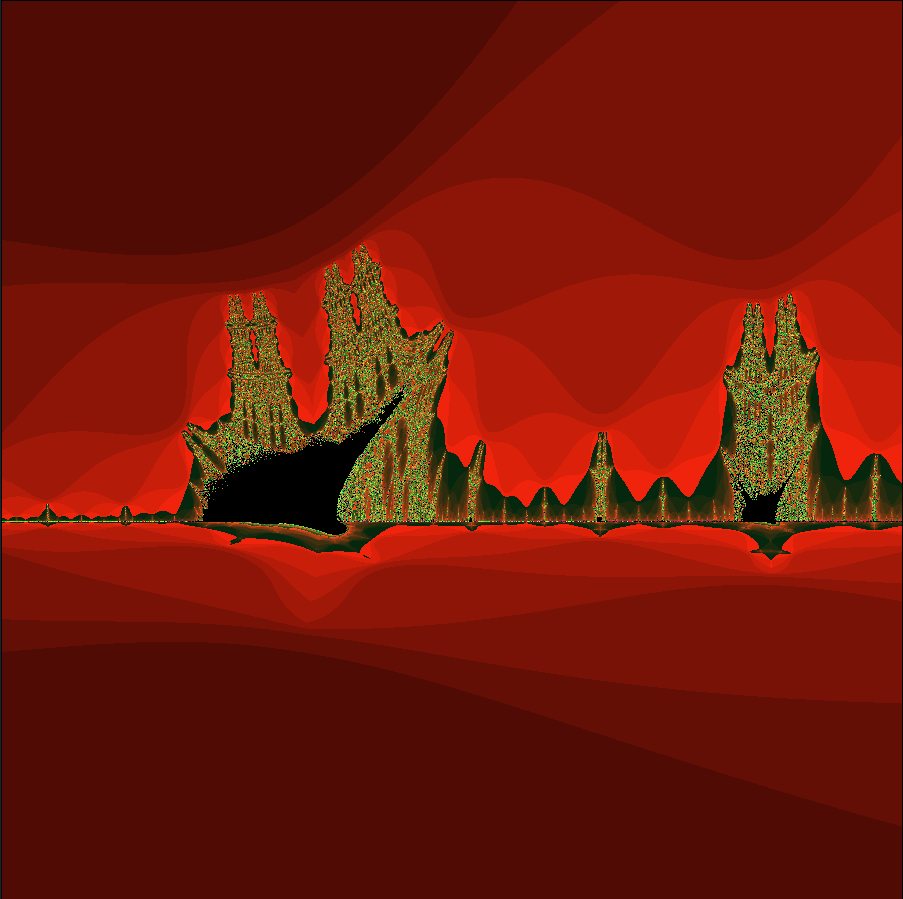

# Fract-ol - 42 Project

  
*Example of Julia -0.8 -0.16 fractal generated by fract-ol*

## Description

Fract-ol is a 42 school project that generates beautiful fractal images on the screen using the MiniLibX library. This program allows you to explore various fractals interactively, including the famous Mandelbrot set, Julia sets, and burnigship.

## 🚀 **Features**  

### **Fractals Implemented**  
✔ **Mandelbrot** – Classic fractal with deep zoom capability  
✔ **Julia Sets** – Dynamic parameter adjustment (mouse movement)  
✔ **Burning Ship** – Striking geometric variant

### **Controls**  
| **Key**                   | **Action**                         |  
|---------------------------|------------------------------------|  
| `Mouse Wheel`             | Zoom in/out at cursor position     |  
| `N`                       | Shift Julia set *Julia only*.      |  
| `Arrow Keys` or `WASD`    | Pan the fractal                    | 
| `C`                       | Cycle color schemes                | 
| `ESC` or `close window`   | Quit                               |   

*(Bonus: Added CLI help when you run the program!)*

---

## 🔧 **Installation & Usage**  

### Requirements
MiniLibx for Linux requires `xorg`, `x11`, and `zlib`, therefore you will need to install the following dependencies:

```bash
sudo apt-get update 
sudo apt-get install xorg libxext-dev zlib1g-dev libbsd-dev
```

### **Clone & Compile**  
```bash  
git clone https://github.com/fog-3/fract-ol.git
cd fract-ol && make  
```  
> [!NOTE]
> If you are in Linux you need `xorg`, `x11`, and `zlib` libraries

### **Run (Examples)**  
```bash  
./fractol mandelbrot        # Mandelbrot  
./fractol julia -0.7 0.27   # Julia Set (custom params)  
./fractol 3                 # Burning Ship Fractal
```  

*(Bonus: Added CLI help with `./fractol`!)*

---

## 🎥 **Demonstration**  

| **Mandelbrot**   | **Julia Set**    | **Burning Ship**  |  
|------------------|--------------------------|-------------|  
|  |  |  |  
| `./fractol mandelbrot`  | `./fractol 2 -0.4 0.6` | `./fractol burning_ship` | 

---


*Developed as part of the **42 School** curriculum.*    
*Author: Fernando (fosuna-g)* <br>
*Date Completed: 2024-09-25*
<p align="center">
    
</p>

---  

### **🚀 Ready to Explore Infinity?**  
```bash  
make && ./fractol mandelbrot  
```  
